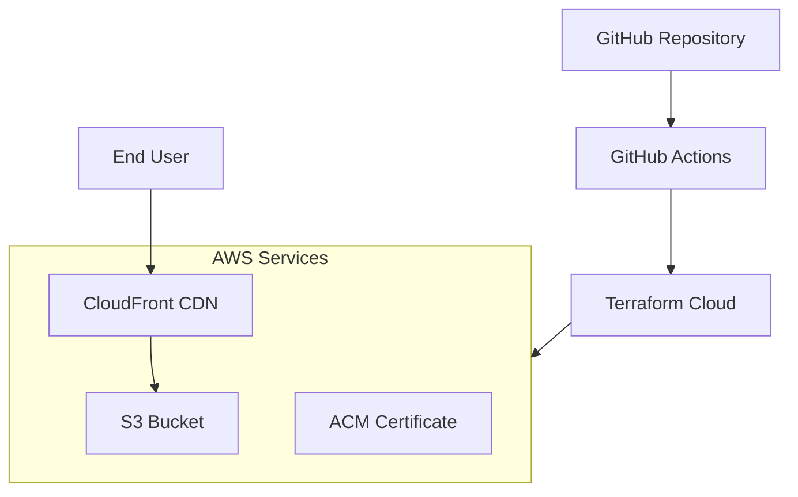

# 🚀 AWS S3 Static Website with Terraform & GitHub Actions

## 📖 Overview

A complete infrastructure-as-code project demonstrating automated deployment of a static website to AWS S3 using Terraform, with CI/CD pipelines via GitHub Actions and remote state management in Terraform Cloud.

## 🏗️ Architecture



## 📁 Project Structure

```
AWS-S3-Static-Website/
├── .github/
│   └── workflows/
│       ├── deploy.yml          # Deployment pipeline
│       └── destroy.yml         # Destruction pipeline
├── modules/
│   └── s3-website/
│       ├── main.tf
│       ├── variables.tf
│       └── outputs.tf
├── environments/
│   ├── dev/
│   │   ├── main.tf
│   │   ├── variables.tf
│   │   └── terraform.tfvars
│   └── prod/
│       └── ...
├── website/
│   ├── index.html
│   ├── styles.css
│   └── script.js
├── main.tf
├── variables.tf
├── outputs.tf
├── providers.tf
├── backend.tf
└── README.md
```

## 🚀 Features

- ✅ **Infrastructure as Code** - Complete Terraform configuration
- ✅ **CI/CD Pipelines** - GitHub Actions for automated deployments
- ✅ **Remote State Management** - Terraform Cloud for state storage
- ✅ **Modular Design** - Reusable Terraform modules
- ✅ **Multi-environment** - Dev/Prod environment support
- ✅ **CloudFront CDN** - Global content delivery
- ✅ **HTTPS Encryption** - SSL/TLS with ACM certificates
- ✅ **Custom Domain** - Route53 DNS configuration
- ✅ **Cost Optimization** - S3 + CloudFront cost-effective hosting

## 🛠️ Technologies Used

- **Terraform** - Infrastructure as Code
- **AWS Services** - S3, CloudFront, ACM, Route53, IAM
- **GitHub Actions** - CI/CD Pipelines
- **Terraform Cloud** - Remote State Management
- **HTML/CSS/JS** - Static Website Content

## 📋 Prerequisites

Before you begin, ensure you have:

1. **AWS Account** with appropriate permissions
2. **Terraform Cloud Account** for state management
3. **GitHub Account** for repository and actions
4. **Domain Name** (optional) for custom domain setup

## ⚙️ Setup Instructions

### 1. Clone the Repository

```bash
git clone https://github.com/tasnimmizaoui/AWS-S3-Static-Website-.git
cd AWS-S3-Static-Website
```

### 2. Terraform Cloud Setup

1. Create Terraform Cloud account at [app.terraform.io](https://app.terraform.io)
2. Create a new organization
3. Generate an API token: **Settings > Tokens > Create API Token**
4. Store token in GitHub Secrets as `TF_API_TOKEN`

### 3. AWS Credentials Setup

Create IAM user with required permissions:

```bash
# Minimum required policies:
- AmazonS3FullAccess
- CloudFrontFullAccess
- AmazonRoute53FullAccess
- AWSCertificateManagerFullAccess
- IAMReadOnlyAccess
```

Store credentials in GitHub Secrets:
- `AWS_ACCESS_KEY_ID`
- `AWS_SECRET_ACCESS_KEY`

### 4. GitHub Secrets Configuration

Navigate to: **Repository Settings > Secrets > Actions**

Add the following secrets:
- `TF_API_TOKEN` - Terraform Cloud API token
- `AWS_ACCESS_KEY_ID` - AWS IAM access key
- `AWS_SECRET_ACCESS_KEY` - AWS IAM secret key

### 5. Terraform Configuration

Update `backend.tf` with your Terraform Cloud details:

```hcl
terraform {
  backend "remote" {
    organization = "your-organization-name"
    workspaces {
      name = "aws-s3-website"
    }
  }
}
```


## 🚀 Deployment

### Manual Deployment via GitHub Actions

1. Navigate to **Actions** tab in your repository
2. Select **"Deploy Infrastructure"** workflow
3. Click **"Run workflow"** 
4. Select branch and environment
5. Monitor the execution progress

### Automated Deployment on Push

Push to main branch triggers automatic deployment:

```bash
git add .
git commit -m "Deploy website updates"
git push origin main
```

### Destroy Infrastructure

**Warning**: This will delete all AWS resources!

1. Navigate to **Actions > Destroy Infrastructure**
2. Click **"Run workflow"**
3. Confirm destruction (requires manual approval if configured)

## 📊 GitHub Actions Workflows

### Deployment Pipeline (`deploy.yml`)

### Destruction Pipeline (`destroy.yml`)

## 🎯 Learning Outcomes

### Terraform Best Practices
- **Module-based architecture** for reusability
- **Remote state management** with Terraform Cloud
- **Variable validation** and type constraints
- **Output values** for cross-module communication
- **Environment separation** using workspaces or directories

### AWS Infrastructure Patterns
- **S3 static website hosting** configuration
- **CloudFront distribution** for CDN and HTTPS
- **Route53 DNS** management with Terraform
- **ACM certificate** provisioning and validation
- **IAM policies** for least privilege access

### CI/CD Implementation
- **GitHub Actions workflows** for automation
- **Environment protection** and approval processes
- **Artifact management** for plan files
- **Secret management** with GitHub Secrets
- **Concurrency control** to prevent conflicts

### Error Handling & Debugging
- **Terraform validation** and format checking
- **Plan review process** before apply
- **Destruction safeguards** with manual approval
- **Logging and output** for debugging
- **State recovery** procedures

## 📈 Performance Metrics

| Metric | Value | Description |
|--------|-------|-------------|
| Deployment Time | ~5-7 minutes | Full infrastructure creation |
| Cost Estimate | < $1/month | S3 storage + CloudFront requests |
| Availability | 99.9% | Global CDN distribution |
| SSL Rating | A+ | TLS 1.2+ with modern ciphers |

## 🔒 Security Considerations

1. **IAM Least Privilege** - Minimal required permissions
2. **SSL Encryption** - HTTPS only traffic
3. **S3 Bucket Policies** - Block public access except through CloudFront
4. **GitHub Secrets** - Secure credential storage
5. **Terraform Cloud** - Secure state management

## 💡 Advanced Features

### Custom Domain Setup
```hcl
module "website" {
  source = "./modules/s3-website"
  
  domain_name    = "yourdomain.com"
  create_dns     = true
  create_cert    = true
  enable_cdn     = true
}
```

### Environment Variables
```hcl
# environments/dev/terraform.tfvars
bucket_name = "dev-website-bucket"
domain_name = "dev.yourdomain.com"
environment = "development"
```

### Website Upload Automation
```yaml
- name: Upload Website Files
  run: |
    aws s3 sync ./website s3://${{ steps.terraform-output.outputs.bucket_name }} \
      --delete \
      --cache-control "max-age=31536000"
```

## 🐛 Troubleshooting

### Common Issues & Solutions

1. **"Required token could not be found"**
   - Solution: Ensure `TF_API_TOKEN` is set in GitHub Secrets

2. **"No valid credential sources found"**
   - Solution: Check AWS credentials in GitHub Secrets

3. **"Error: Failed to get existing workspaces"**
   - Solution: Create workspace manually in Terraform Cloud first

4. **"S3 bucket name already exists"**
   - Solution: Use unique bucket names across AWS

### Debugging Commands

```bash
# Check Terraform configuration
terraform validate
terraform fmt -check

# Plan without applying
terraform plan -out=tfplan

# Show current state
terraform show

# List resources
terraform state list
```

## 📚 Resources & References

- [Terraform AWS Provider Documentation](https://registry.terraform.io/providers/hashicorp/aws/latest/docs)
- [GitHub Actions Documentation](https://docs.github.com/en/actions)
- [Terraform Cloud Documentation](https://www.terraform.io/docs/cloud/)
- [AWS S3 Static Website Hosting](https://docs.aws.amazon.com/AmazonS3/latest/userguide/WebsiteHosting.html)

## 🎓 Conclusion

This project demonstrates modern infrastructure automation practices combining Terraform, AWS, and GitHub Actions. It provides a production-ready template for static website hosting with best practices for security, cost optimization, and maintainability.

## 👥 Contributors

- [Mizaoui Tasnim](https://github.com/tasnimmizaou)


---

**⭐ If you found this project helpful, please give it a star on GitHub!**

---
